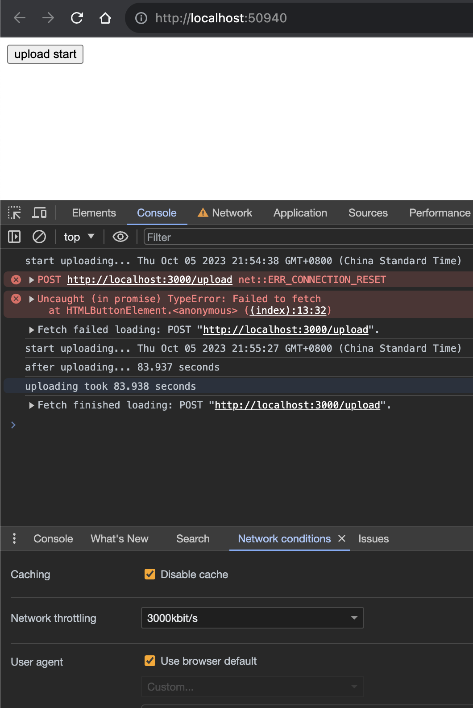

# how to run

## 1. install package

```
$ npm install
```

## 2. run the server

```
$ node index.js
```

## 3. open index.html

click the `index.html` in the browser

## 4. setup slow network condition

open chrome devtools and then `shift+command+p` search `network conditions` then choose a bad network throttling

## 5. click the upload button

and the result will show in the console


